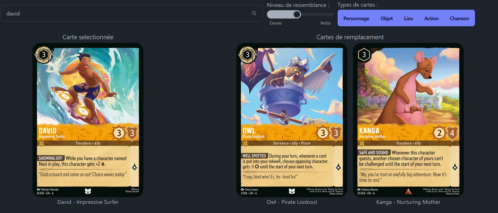
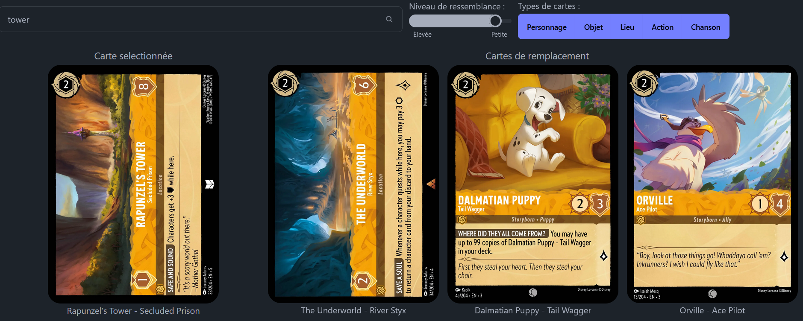
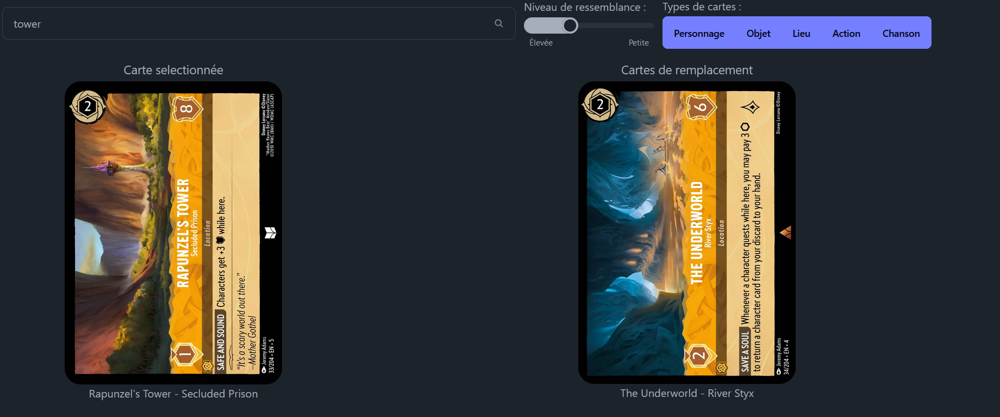
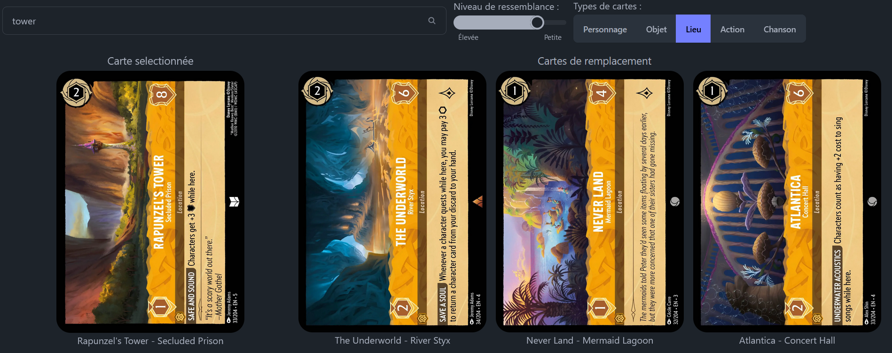

# INFO907 - Ingénierie des connaissances
## Ontologie et application web pour suggérer des cartes Lorcana

### Auteurs
- **BEAUDEAU Elyne**
- **DUPASQUIER Antoine**

### Lancer l'application
```shell
cd .\LorcanaCardMatchup\
```
```shell
npm i
```
```shell
ng serve
```

L'application sera accessible sur [localhost:4200](http://localhost:4200/).

---
## Contexte
Lorcana est un jeu de carte à collectionner (TCG - Trading Cards Game). Les TCG les plus connus sont : Magic, Pokémon, Yu-Gi-Oh!

Les grands principes des TCG sont : 
- Collectionner toutes les cartes du jeu
  - Échanges de cartes entre joueurs
  - Achat de cartes via les plateformes spécialisées
  - Ouvertures de boosters (paquets d'un certain nombre de cartes qui sont aléatoires)
- Créer son deck pour jouer (exemple avec les règles de Lorcana)
  - Avoir un minimum de 60 cartes
  - Ne pas dépasser 2 couleurs différentes
  - Ne pas avoir plus de 4 fois une même carte (nom complet)
  - Respecter un certain ratio pour que le deck soit jouable
    - Avoir seulement environ un quart de carte non-encrable
    - Respecter une bonne courbe de coût
      - La courbe de coût représente le nombre de cartes que nous avons dans notre deck en fonction de leur coût à jouer
      

### Les cartes
Il existe 5 types de cartes dans Lorcana :
- Objet
- Lieu
- Action
- Chanson
- Personnage (le type de carte le plus complet, qui constitue une grande partie du deck en général)


### Utilité de notre application
Imaginons que sur internet, nous avons trouvé **LE** deck parfait, mais il nous manque quelques cartes dans notre collection. 
Grâce à cette application, nous pouvons trouver des cartes semblables à celles qui nous manquent en utilisant les différents filtres. 
La façon dont nous avons généré notre ontologie favorise le coût et la couleur de la carte, ce qui a pour but de ne pas trop chambouler la courbe de coût initiale.

## Les données
Nous avons récupéré nos données via l'api https://lorcana-api.com/, que nous avons entièrement téléchargé pour les traiter en local.
- Url de l'api : api.lorcana-api.com
- Url pour get toutes les cartes : api.lorcana-api.com/bulk/cards

## Ontologie :

### Attributs des cartes :

- Colors : Amber / Amethyst / Emerald / Ruby / Sapphire / Steel
- Inkable : Inkable / notInkable
- Cost : 0-10
- Types : Item / Character / Action / Location
      - Song
- Abilities : Bodyguard / Challenger / Evasive / Rush / Shift / Support / Ward / Reckless / Resist / Singer / Sing Together
- Classifications : Alien / Hero / Villain / Ally / Dreamborn / Storyborn / Floodborn / Captain / Mentor / Prince / Princess / Queen / King / Leader / Explorer / Performer / Artist / Inventor / Sorcerer / Assistant / Warrior / Pirate / Thief / Soldier / Archer / Beast / Animal / Creature / Monster / Trader / Musketeer
- Strength : 0-10
- Willpower : 1-10
- Lore : 0-5
- Move_Cost : 0-6 


### Exemple d'arbre :

- Carte Lorcana
  - amber
      - inkable 
         - cost_1
            - item
              - Dinglehopper
            - character
              - challenger
              - evasive
              - ...
            - action
              - song
            - location
         - cost_2
          - ...
         - cost_3
           - character
               - bodyguard
                   - musketeer
                     - ...
                     - strength_2
                       - willpower_3
                         - lore_1
                           - Donald Duck - Musketeer Soldier
         - ...
     - notInkable
  - amethyst
  - emerald
  - ruby
  - sapphire
  - steel


## Transormation des données :

- On récupère les données sous la forme d'un Json dans ./input.json
- On utilise parseData de manière à pouvoir formater les données et on les enregistre dans un fichier json ./output.json
- On utilise ensuite GenerateOntologie.js qui permet de générer l'ontologie à partir des données formatées.
  - On récupère les données du fichier ./output.json
  - Les cartes n'ont pas toutes les mêmes attributs, on a donc fait des conditions sur chaque attribut
  - On a ensuite généré un fichier json ./outputOntologie.json qui contient l'ontologie
- Ce fichier est ensuite utilisé par le site web.
- Les fonctions de traitement de cette ontologie sont dans le service ./LorcanaCardMatchup/src/app/card.service.ts
  - On a une fonction qui nous permet de récupérer les 5 cartes les plus proches.
    - on récupère le chemin de la carte avec son nom en parcourant l'ontologie
    - on récupère les cartes les plus proches en parcourant l'ontologie grâce à notre chemin, en commençant par les caractéristiques les plus profondes

Le curseur sur le site web permet de choisir une limite de profondeur lors de la récupération des 5 cartes les plus proches.
Les catégories permettent de filtrer les cartes en fonction de leur type.

## Exemple de résultats
### Recherche d'un personnage sans filtre


### Recherche d'un lieu avec un faible taux de resemblance 


### Recherche d'un lieu avec un haut taux de resemblance


### Recherche d'un lieu avec uniquement d'autres lieux en résultats (taux de resemblance moyen)
